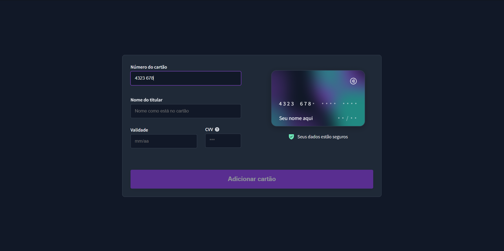
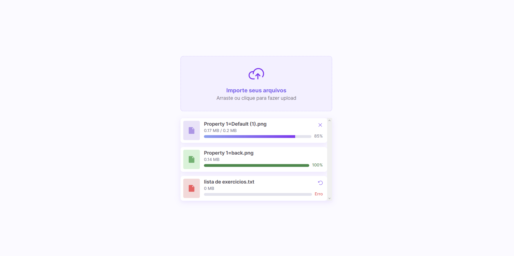

<h1 align="center">Desafios Bora Codar</h1>

 

<h2>DevLinks</h2>

Página desenvolvida durante o curso devLinks, onde desenvolvi muitas habilidades com HTML, JavaScript, CSS e Git/Github!

 

# 🚀 Tecnologias
Projetos desenvolvidos com as seguintes tecnologias:
<ul>
  <li>HTML e CSS</li>
  <li>JavaScript</li>
  <li>Git e Github</li>
  <li>Figma</li>
</ul>
 

# 💻 Projetos
Você pode acessar as páginas do DevLinks e os desafios pelos seguintes links:
<ul>
  <li><a href="https://lukasrib15.github.io/Desafios-boraCodar/devlinks/">DevLinks</a></li>
  <li><a href="https://lukasrib15.github.io/Desafios-boraCodar/desafio%201/">Desafio 1</a></li>
  <li><a href="https://lukasrib15.github.io/Desafios-boraCodar/desafio%202/">Desafio 2</a></li>
  <li><a href="https://lukasrib15.github.io/Desafios-boraCodar/desafio%208/">Desafio 8</a></li>
  <li><a href="https://lukasrib15.github.io/Desafios-boraCodar/desafio%209/">Desafio 9</a></li>
  <li><a href="https://lukasrib15.github.io/Desafios-boraCodar/desafio%2010/">Desafio 10</a></li>
  <li><a href="https://lukasrib15.github.io/Desafios-boraCodar/desafio%2011/">Desafio 11</a></li>
  <li><a href="https://lukasrib15.github.io/Desafios-boraCodar/desafio%2012/">Desafio 12</a></li>
  <li><a href="https://lukasrib15.github.io/Desafios-boraCodar/desafio%2013/">Desafio 13</a></li>
  <li><a href="https://lukasrib15.github.io/Desafios-boraCodar/desafio%2014/">Desafio 14</a></li>
  <li><a href="https://lukasrib15.github.io/Desafios-boraCodar/desafio%2015/">Desafio 15</a></li>
  <li><a href="https://lukasrib15.github.io/Desafios-boraCodar/desafio%2016/">Desafio 16</a></li>
  <li><a href="https://lukasrib15.github.io/Desafios-boraCodar/desafio%2017/">Desafio 17</a></li>
  <li><a href="https://lukasrib15.github.io/Desafios-boraCodar/desafio%2018/">Desafio 18</a></li>
  <li><a href="https://lukasrib15.github.io/Desafios-boraCodar/desafio%2019/">Desafio 19</a></li>
  <li><a href="https://lukasrib15.github.io/Desafios-boraCodar/desafio%2020/">Desafio 20</a></li>
  <li><a href="https://lukasrib15.github.io/Desafios-boraCodar/desafio%2021/">Desafio 21</a></li>
  <li><a href="https://lukasrib15.github.io/Desafios-boraCodar/desafio%2022/">Desafio 22</a></li>
  <li><a href="https://lukasrib15.github.io/Desafios-boraCodar/desafio%2023/">Desafio 23</a></li>
</ul>

Obs: Essa lista será atualizada a cada desafio concluído!

 

<h2>Desafios</h2>

Desafio 1: Feito com HTML e CSS

 
Desafio 2: Feito com HTML, CSS e JavaScript

 
Desafio 8 : Feito com HTML e CSS (Donut Chart e Animations)

 
Desafio 9: Feito com HTML, CSS, JavaScript e ApexCharts

 
Desafio 10: Feito com HTML e CSS

 
Desafio 11:  Feito com HTML, CSS e JavaScript

 
Desafio 12:  Feito com HTML, CSS e JavaScript (Drag and Drop)

 
Desafio 13: Feito com HTML, CSS (Flip do cartão), JavaScript e IMaskJs

 
Desafio 14: Feito com HTML, CSS, JavaScript (Drag and Drop)

 
Desafio 15: Feito com HTML e CSS

 
Desafio 16: Feito com HTML, CSS, JavaScript e IMaskJs

 
Desafio 17: Feito com HTML, SASS e JavaScript

 
Desafio 18: Feito com HTML e CSS (Apenas versão desktop)

 
Desafio 19: Feito com HTML e SASS

 
Desafio 20: Feito com HTML e CSS

 
Desafio 21: Feito com HTML, SASS, JavaScript e PhosphorIcons (biblioteca de ícones)

 
Desafio 22: Feito com HTML, SASS e PhosphorIcons (biblioteca de ícones)

 
Desafio 23: Feito com HTML, SASS e JavaScript

